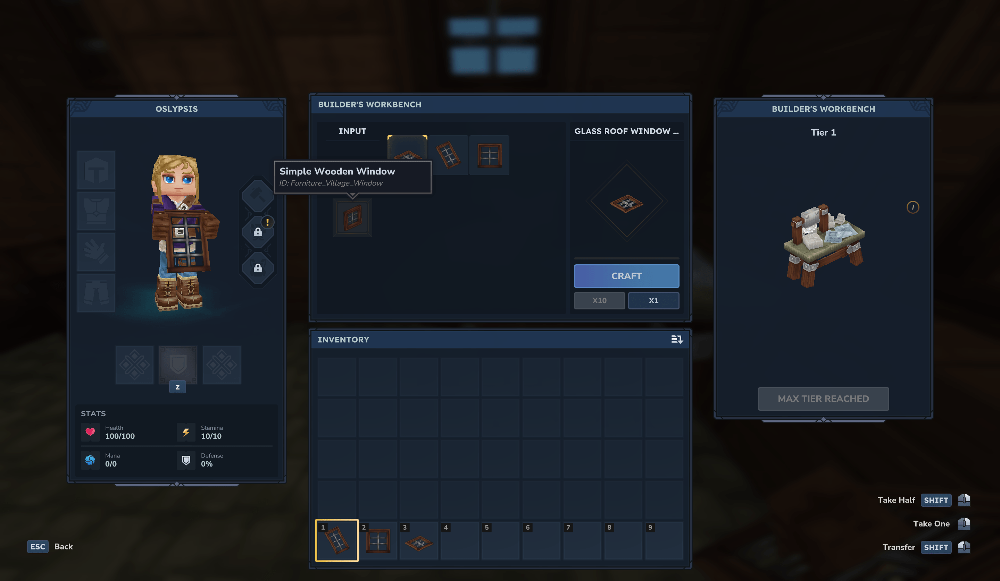
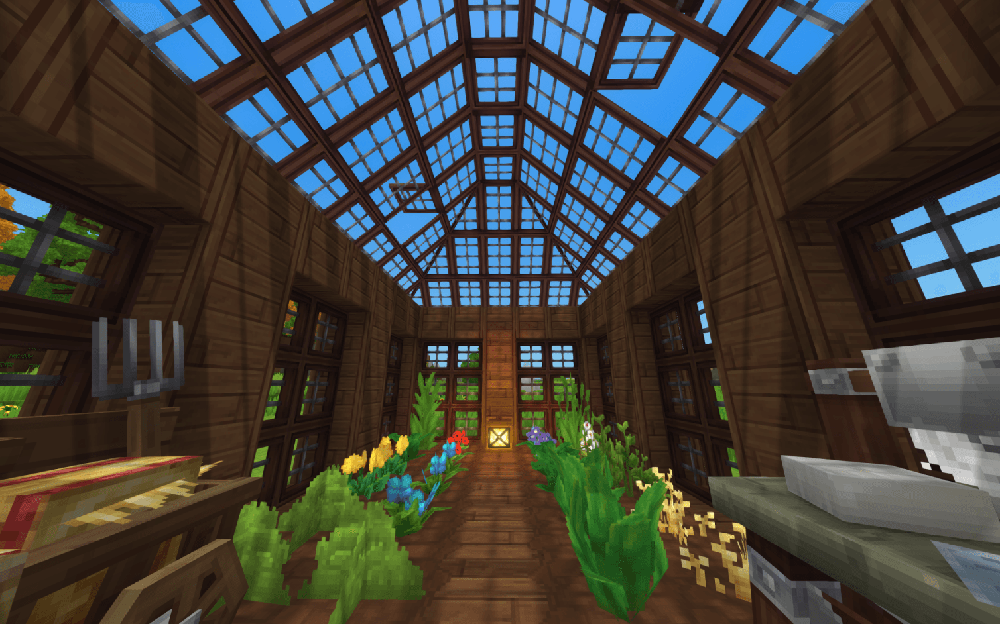
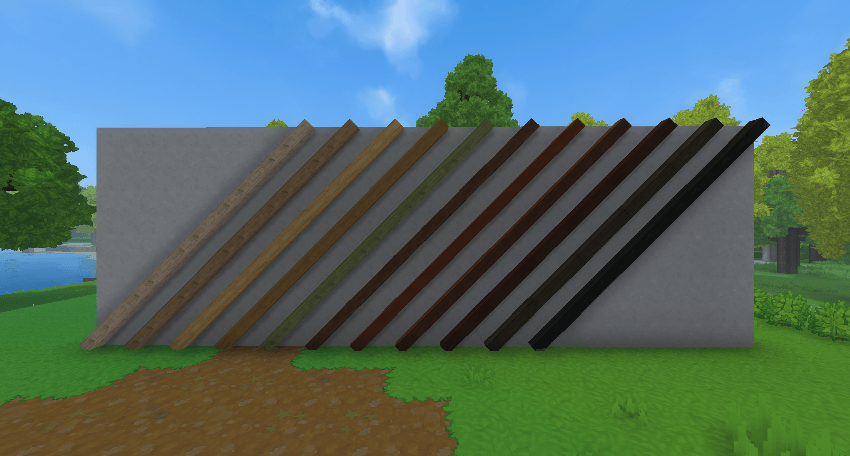
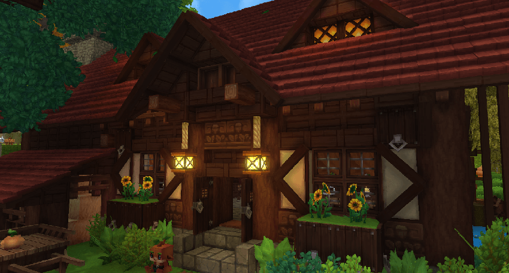

import { Accordion, Accordions } from 'fumadocs-ui/components/accordion';

Here is a list of added blocks and modifications that builders can use to enhance their builds on our server.

## Glass Window Roofs
We have added glass window roofs that allow builders to create beautiful skylights and roof designs using transparent materials.

Those blocks can be obtained via **Builder's Workbench** by putting regular glass panes into the workbench.

<Accordions type="single">
	<Accordion title="Builder's Workbech"></Accordion>
	<Accordion title="Usage example"></Accordion>
</Accordions>

## Diagonal Beams
Diagonal beams have been added to provide more flexibility in building structures with angled supports and decorative elements.

All diagonal beams are craftable in the **Furniture Workbench** using their matching wood types, e.g. Oak Planks for Oak Diagonal Beams.

<Accordions type="single">
	<Accordion title="Furniture Workbech"></Accordion>
	<Accordion title="Usage example"> </Accordion>
</Accordions>

## More door options
In Hytale assets, there are more options for doors, but they are not available to craft in-game by default. Those doors can be obtained via **Furniture Workbench**.

Available options:
- All in-game 3x3 Hytale doors
- All in-game 2x2 Hytale doors
- All 1x2 doors (not available for now)

<Accordions type="single">
	<Accordion title="Preview of doors"></Accordion>
</Accordions>
